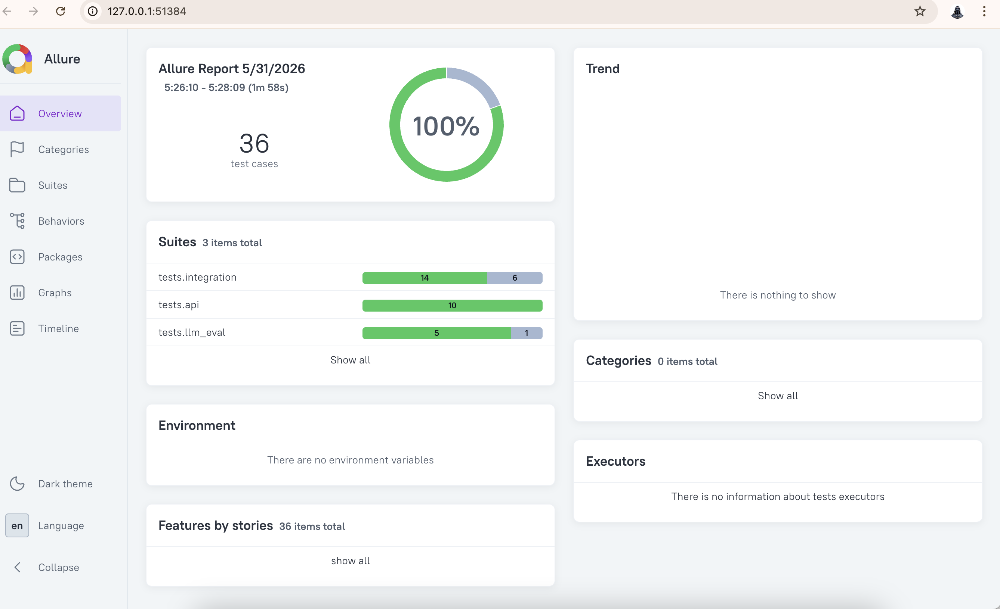

# agenteval-platform-openshift

A pytest-based AI/LLM test automation framework for validating
model serving, hallucination detection, and RAG pipeline quality
on Red Hat OpenShift AI.

## What This Tests

| Layer | What | Tools |
|-------|------|-------|
| Model Serving API | Inference endpoints, latency, edge cases | pytest, httpx |
| LLM Output Quality | Hallucination, prompt regression, relevancy | DeepEval |
| RAG Pipeline | Faithfulness, retrieval quality, context precision | Ragas, LangChain |
| OpenShift AI Integration | KServe endpoints, model lifecycle | httpx, OpenShift SDK |

## Why This Exists

AI systems fail differently from traditional software.
A model can return HTTP 200 and still hallucinate, fabricate
facts, or give irrelevant answers. This framework tests what
matters — the quality and reliability of AI behaviour,
not just whether the API responds.

## Tech Stack

| Layer | Tools |
|-------|-------|
| Test execution | pytest, httpx |
| Local LLM | Ollama — llama3.2 |
| Judge LLM | Groq — llama-3.3-70b-versatile |
| RAG pipeline | LangChain, ChromaDB, nomic-embed-text |
| LLM evaluation | Custom Groq judge |
| CI pipeline | GitHub Actions |
| Reporting | Allure, pytest-html |
| Target platform | Red Hat OpenShift AI |
| Environments | Local + OpenShift AI sandbox |
## Project Structure


```
agenteval-platform-openshift/
│
├── tests/
│   ├── api/
│   │   ├── test_model_serving.py      # Model API health, latency, schema
│   │   └── test_model_edge_cases.py   # Edge cases, concurrent requests
│   │
│   ├── llm_eval/
│   │   ├── test_hallucination.py      # Hallucination, faithfulness, relevancy
│   │   └── test_prompt_regression.py  # Prompt consistency, safety testing
│   │
│   └── integration/
│       ├── rag_pipeline.py            # LangChain + ChromaDB RAG agent
│       ├── test_rag_agent.py          # RAG retrieval + answer quality
│       ├── test_ragas_evaluation.py   # Custom Groq RAG scoring
│       └── test_openshift_ai.py       # OpenShift AI + KServe protocol tests
│
├── config/
│   └── test_config.yaml              # Thresholds, endpoints, environments
│
├── reports/
│   ├── allure-results/               # Allure raw results (gitignored)
│   ├── allure-report/                # Allure HTML report (gitignored)
│   └── report.html                   # pytest-html report (gitignored)
│
├── conftest.py                        # Shared fixtures, Groq judge, env config
├── pytest.ini                         # pytest config, plugin settings
├── requirements.txt                   # Pinned dependencies
├── TEST_STRATEGY.md                   # Full test strategy document
├── .env                               # API keys (gitignored)
├── .gitignore                         # Excludes venv, reports, .env
└── .github/
    └── workflows/
        └── ci.yml                     # GitHub Actions CI pipeline
```

## Quick Start

```bash
# Clone the repo
git clone https://github.com/alakapatnaik/agenteval-platform.git
cd agenteval-platform

# Create and activate venv
python -m venv venv
source venv/bin/activate

# Install dependencies
pip install -r requirements.txt

# Start local LLM
ollama serve &
ollama pull llama3.2

# Run tests
pytest tests/api/ -v --html=reports/report.html
```

## Test Results

| Suite | Tests | Status |
|-------|-------|--------|
| Model Serving API | 5 | ✅ Passing |
| Edge Cases | 5 | ✅ Passing |
| LLM Evaluation | 6 | ✅ Passing |
| RAG Pipeline | 6 | ✅ Passing |
| RAG Evaluation | 5 | ✅ Passing |
| OpenShift AI Serving | 6 | ✅ Passing |
| **Total** | **36** | ✅ 100% Pass Rate |

## Environments Tested

| Environment | Status |
|-------------|--------|
| Local — Ollama llama3.2 | ✅ Passing |
| Red Hat OpenShift AI Sandbox | ✅ Model deployed, 5/5 containers running |

## LLM Evaluation Scores

| Metric | Score | Threshold |
|--------|-------|-----------|
| Hallucination | < 0.3 | < 0.5 |
| Faithfulness | > 0.7 | > 0.3 |
| Answer Relevancy | > 0.8 | > 0.3 |
| Context Precision | > 0.6 | > 0.3 |

## Reporting
Test results available via:
- **Allure Report** — run `allure open reports/allure-report`
- **pytest-html** — open `reports/report.html`


## Test Report — Allure Dashboard



> 36 test cases — 100% pass rate across all layers

## Author

## Author

**Alaka Pattnaik**
## Author

**Alaka Pattnaik**
QA & Engineering Leader | 14+ Years | AI/LLM Test Automation

📍 Bengaluru, India | Immediate Joiner

### Background
- 14+ years of Quality Engineering experience
- Led QE at **Epsilon** (2020–2025) — BigData pipeline testing 
  on cloud-native infrastructure at scale
- Currently building open source AI/LLM test automation 
  frameworks targeting Red Hat OpenShift AI

### Expertise
- AI/LLM testing — hallucination detection, RAG evaluation, 
  prompt regression
- BigData validation — Kafka, Spark, PySpark, Cassandra
- Cloud-native QE — Kubernetes, OpenShift, AWS
- Python/pytest automation frameworks
- CI/CD quality gates — GitHub Actions, Jenkins

### Open To
- Engineering Manager — Quality Engineering
- Staff SDET / Test Architect
- Principal SDET
- AI/LLM QE Leadership roles

### Connect
[](https://linkedin.com/in/YOUR-LINKEDIN)
[](https://github.com/alakapatnaik)

> "AI systems fail differently from traditional software — 
> my framework tests what matters: hallucination, faithfulness, 
> RAG quality, and model serving reliability."


